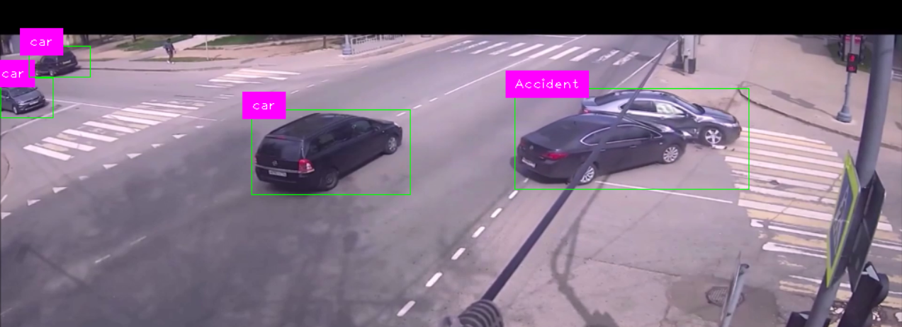

# YOLO-Based Object Detection from Video (Phase-1)

This project implements real-time object detection using a custom-trained YOLOv8 model. It reads a video file, detects objects frame by frame, and displays bounding boxes with labels using OpenCV and CVZone.

---

## 🔍 Sample Result


## 📸 Project Overview

- Loads a video file (`cr.mp4`) and processes it with a custom YOLOv8 model (`best.pt`)
- Uses a COCO-style text file (`coco1.txt`) to map class indices to names
- Draws bounding boxes and class labels on detected objects using `cv2` and `cvzone`
- Displays live video frames with annotations and allows interaction with mouse pointer

## 🚀 Optimizations Implemented

To enhance performance, especially on limited hardware:

- **Frame Skipping**: Only every third frame is processed (`count % 3 != 0`) to reduce computation
- **Frame Resizing**: Frames are resized to `1020x500` for faster processing without losing much detail
- **Efficient YOLOv8 Use**: Utilizes `ultralytics` optimized PyTorch-based backend for detection
- **Mouse Interaction Hook**: Minimal event logic to allow frame interaction without interrupting pipeline

## 📂 File Structure


## 📦 Requirements

See `requirements.txt` for the list of Python dependencies with version info.

Install with:

```bash
pip install -r requirements.txt
```

## ▶️ Running the Project
Ensure you have your custom YOLO model (best.pt), a video file in Images/cr.mp4, and coco1.txt class labels in the same directory.

```bash
python main.py
```
Press **Esc** to exit the video window.

---


## 🛠 Future Enhancements
Real-time camera detection support

Asynchronous detection with threading

Automatic FPS-based frame skipping


This project implements phase one of YOLO-based object detection from video, with optimizations for frame skipping and resizing, and further updates will be pushed later.
